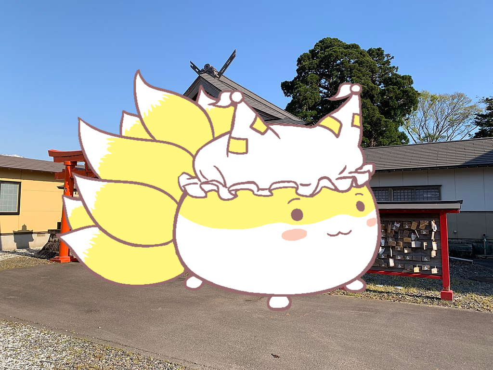

# Ninetail

    

## Overview
A general-use fox-themed Discord bot, written in Java with [JDA (Java Discord API)](https://github.com/discord-jda/JDA) and C++ (via `java.lang.foreign`).

## Usage:
To use the bot, ensure that Java is installed.

Before starting the bot, you must create a file `config.properties` in `app/src/main/resources`, containing a bot token and a shutdown password.
In that directory, there is a file called `INSTRUCTIONS.txt`.

To start the bot, use `./gradlew run`.

To shut off the bot, run the `shutdown` bot command with your shutdown password. (`Ctrl + C` works too, but the former is preferred.)

## TODO:
Upcoming features:
- Include support for other streaming services
- Implement imageboard image grabbing utilities
- Implement simple games with the bot (using C++)